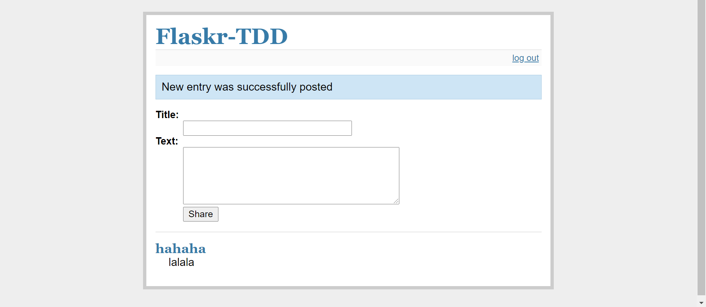
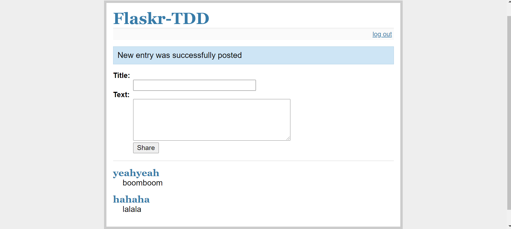

# ECE444-F2020-Lab6

## Screenshots
### Screenshot for part 9: Adding some styles

  

### Screenshot for part 10: JavaScript interaction

Before deletion:

  

After deletion:

  

### Screenshot for part 12: Bootstrap

  

### Screenshot for part 14: Search Page

  

### Screenshot for part 15: Login required

  

### Heroku server
The address of Heroku server after deployment is: https://sleepy-falls-94086.herokuapp.com/